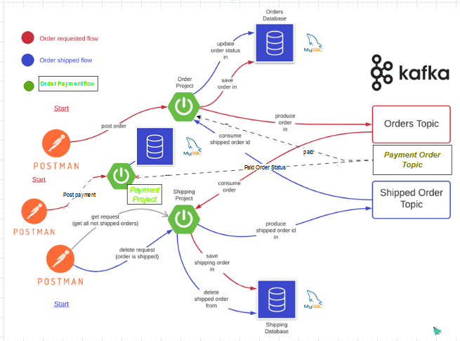

### Spring Kafka Order Processing Services
- The demo project with Spring boot and Apache Kafka for order processing REST API.

## Prerequisites
- Spring Boot (2.7.5)
- Maven 
- Java (11)
- Libraries:
  * starter-web 
  * kafka
  * lombok/logback
  * MySQL
  * spring-data-jpa

## Flow Diagram


## Step 01: Run Kafka Service locally as below:
- Kafka Servers Start (local: eg. C:\kafka_2.13-3.7.0) with zookeeper.
* 1) .\bin\windows\zookeeper-server-start.bat .\config\zookeeper.properties
* 2) .\bin\windows\kafka-server-start.bat .\config\server.properties

## Step 02: Configure (if required) database in application.properties files in 3 microservices (sk-order-service, sk-payment-service and sk-shipping-service).

## Step 03: Run 3 microservices

## Step 04: Call following REST API
- [POST] http://localhost:9191/orders/checkout with following request body (create multiple records).
```
{
    "customerName": "Your Name",
    "totalCost": 100.25,
    "address": "Your Address"
}
```

- [POST] http://localhost:9292/payments/order/<order id> with following request body:

```
{
    "customerCardNumber": "4724-0000-1111-6566",
    "amount": 100.25,
    "customerName": "your name"
}
```
* Card Numbers to use (as below) for payment validation for this demo.
```
 Customer Card Number  Validation Balance Amount
 4724-0000-1111-6566   12000.00
 5446-1212-0000-8547   10000.25
 5510-9999-6501-3939   5000.05
 2929-2598-000-7	   8000.00
```
- [DELETE] http://localhost:9293/shipping/v2/shipped/<order number> for shipping transaction

- [GET] http://localhost:9293/shipping/orders to check remaing order list for shipping.